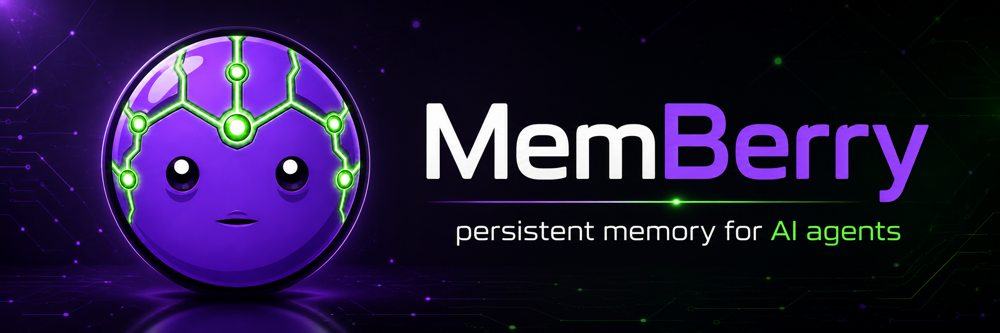

# MemBerry — persistent memory for AI agents

<p align="center">
  
</p>

**Every AI agent starts from zero.** A coding agent forgets last week's architecture decisions. A personal assistant re-asks your preferences. A business agent re-learns your org chart every conversation. Every session, you re-explain. Every session, the same mistakes you already corrected.

**MemBerry fixes that.**

MemBerry is persistent, cross-session memory for *any* agent — a knowledge graph your agent reads and writes through MCP tools. Decisions get stored. Corrections stick. Knowledge compounds. The agent on day 30 starts with everything it learned on days 1–29 — the decisions, the tradeoffs, the "we tried that and here's why it didn't work."

It fits any domain. A **coding** agent that remembers your architecture, conventions, and why approach X failed. A **personal** agent that knows your preferences, the people in your life, and your ongoing projects. A **business** agent that holds your org chart, customers, and processes. Coding is the deepest-supported example — MemBerry ships AST code intelligence, architecture mapping, and PR-impact analysis — but the memory model is general-purpose.

It's not RAG. RAG retrieves documents and forgets. MemBerry **learns** — episodic memories consolidate into high-confidence principles through signal-driven evolution, the same way a person builds intuition over time. When knowledge changes, old facts are invalidated and superseded, with a full audit trail. And you can **see** all of it: MemBerry renders your memory as an interactive graph map and audits it for gaps, contradictions, and themes.

---

## What Changes For You

**Before MemBerry:**
- "We already fixed this bug last week" — the agent doesn't know
- "Use the factory pattern here, not direct instantiation" — explained for the third time
- A personal agent re-asks your preferences; a business agent re-learns who owns which account
- The context window fills up re-explaining your project — or yourself — to a blank-slate agent

**After MemBerry:**
- One call loads everything the agent knows — about the project, about you, about your org: decisions, conventions, people, preferences, gotchas
- Corrections from session 3 automatically inform session 30
- When knowledge changes, old facts are invalidated and new ones supersede them — with a full audit trail
- Multiple agents share one evolving knowledge base — and you can browse it as an interactive graph

---

## How It Works

MemBerry is a Neo4j knowledge graph exposed as 49 MCP tools. Your agent calls them autonomously — no workflow changes needed. The example below is a coding session; the same load → store → consolidate loop works for any domain.

```
Session 1: Agent stores "auth module uses JWT, team prefers stateless for horizontal scaling"
                    ↓
Session 5: Agent stores "migrated auth to OAuth2 + PKCE" → old JWT fact auto-invalidated
                    ↓
Session 8: Three agents independently confirm the Zod validation pattern works
                    ↓
           Consolidation promotes "use Zod for validation" to high-confidence principle
                    ↓
Session 15: New agent loads context → knows about OAuth2, Zod convention, and WHY
```

### The Memory Stack

| Layer | What it captures | How it helps |
|-------|-----------------|--------------|
| **Episodic** | What happened each session — decisions, bugs, fixes | Full history, nothing lost |
| **Semantic** | Consolidated principles with confidence scores | "We know X because of Y" with 0.85 confidence |
| **Temporal Facts** | Structured knowledge with time bounds | "Rate limit WAS 100, changed to 50 on March 15" |
| **Architecture** | Entity relationships, aspects, dependency graph | "If you change X, these 12 things break" |
| **Code Intelligence** | AST-parsed symbols, multi-vector search | "Find all callers of this function across the codebase" |

### Progressive Disclosure

Your agent sees 8 tools by default. The other 41 activate on demand — no tool sprawl, no decision fatigue.

```
Always visible:  berry_load · berry_store · berry_memory_read · berry_memory_insert · berry_context · berry_ask · berry_grep · berry_tools
On demand:       9 domains (memory, temporal, admin, research, code, arch, wiki, retrieval, graph)
```

---

## Quick Start

### Prerequisites

- Node.js 20+
- Docker (for Redis + Neo4j)

### Setup

```bash
git clone https://github.com/AP3X-Dev/memberry.git
cd memberry

# Start the knowledge graph
docker compose up -d

# Configure
cp .env.example .env
# Edit .env with your Neo4j password

# Install and run
npm install
npm run dev
```

### Connect to Your Agent

**Claude Code (SSE):**
```json
{
  "mcpServers": {
    "amp": {
      "type": "sse",
      "url": "http://localhost:3101/sse"
    }
  }
}
```

**Claude Code (stdio):**
```json
{
  "mcpServers": {
    "amp": {
      "type": "stdio",
      "command": "npx",
      "args": ["tsx", "packages/mcp/src/server.ts", "--stdio"],
      "cwd": "/path/to/memberry",
      "env": {
        "NEO4J_URI": "bolt://localhost:7687",
        "NEO4J_USER": "neo4j",
        "NEO4J_PASSWORD": "your-password",
        "REDIS_URL": "redis://:your-password@localhost:6379"
      }
    }
  }
}
```

**Works with any MCP-compatible agent:** Claude Code, Cursor, Windsurf, Cline, Codex, or custom agents.

### Hooks — a deterministic context floor (optional)

MCP + skills are **model-driven**: the agent decides whether to call `berry_load`. Hooks make context-loading **harness-driven** instead — MemBerry memory is injected at the start of every session (and every turn, on Claude Code) regardless of whether the model remembers to ask. Hooks complement skills; they don't replace them. The split is deliberate:

- **Load → hooks** (deterministic context-IN). Mechanical; the retrieval ranker decides relevance.
- **Store → MCP/skills** (model-judged knowledge-OUT). Only mechanical stores (session summary, pre-compact snapshot) fire from hooks.

Enable per agent:

```bash
# Claude Code — live hooks (SessionStart + per-turn UserPromptSubmit injection)
npx tsx packages/core/src/cli.ts hooks install --agent claude --scope project

# Codex / Hermes — materialize a managed block into AGENTS.md / .hermes.md,
# refreshed at launch via the wrapper:
npx tsx packages/core/src/cli.ts hooks install --agent codex
memberry run --agent codex -- codex       # re-materializes, then launches codex

npx tsx packages/core/src/cli.ts hooks status      # what's wired where
npx tsx packages/core/src/cli.ts hooks uninstall --agent claude
```

Only **Claude Code** gets live per-turn injection; **Codex** and **Hermes** read a static file at startup, so they get a refreshed start-of-session block (the wrapper keeps it from going stale). Every load hook is **fail-open** with an 800ms timeout — a slow or down MemBerry never blocks a turn.

Prefer a UI? The wiki has a **Settings** page (`/settings`, port 3200) to enable/disable hooks per agent and tune timeouts/token budgets — tuning is written to `~/.config/amp/settings.json` and read live by hook processes (no restart). The same page shows the rest of MemBerry's effective config (cache TTLs, consolidation, decay half-lives, project-tag enforcement, embedding mode).

### Bootstrap Your Project

Copy `CLAUDE.md.example` (or `GEMINI.md.example`, `.cursorrules`) to your project and run `/amp-setup`. The agent analyzes your codebase, discovers entities, and scaffolds the knowledge graph. From that point on, every session loads and stores automatically.

---

## The 49 Tools

### Core Memory (8 always visible + memory management on demand)
| Tool | What it does for you |
|------|---------------------|
| `berry_load` | Start every session with full project context — conventions, decisions, gotchas |
| `berry_store` | Capture decisions and learnings so the next session starts smarter |
| `berry_context` | One-call context assembly — architecture + code + memory blended |
| `berry_ask` | Ask memory a question, get a synthesized cited answer (not raw chunks) — tunable reasoning depth |
| `berry_memory_read/insert` | Structured memory blocks: persona, user preferences, project state |
| `berry_grep` | Search across all memory by pattern |
| `berry_memory_promote/archive` | Graduate working notes to permanent knowledge, or archive completed work |

### Temporal Intelligence (2 tools)
| Tool | What it does for you |
|------|---------------------|
| `berry_timeline` | See how knowledge about any entity evolved over time |
| `berry_fact_diff` | "What changed about auth-module between January and March?" |

### Architecture Understanding (6 tools)
| Tool | What it does for you |
|------|---------------------|
| `berry_impact` | "If I change this module, what breaks?" — blast radius before you touch code |
| `berry_arch_register/relate` | Build a living architecture map that stays current |
| `berry_arch_drift` | Detect when code has changed since the agent last looked |
| `berry_arch_context` | Deterministic architectural context — same graph always produces same output |

### Code Intelligence (7 tools)
| Tool | What it does for you |
|------|---------------------|
| `berry_code_index` | AST-parse your project — every function, class, import becomes searchable |
| `berry_code_search` | Hybrid search: fulltext + dense vectors + lexical vectors + semantic memory |
| `berry_code_ast_grep` | Structural AST search with ast-grep patterns and meta-variable captures |
| `berry_code_deps` | "Who calls this function? What does it import? What inherits from it?" |
| `berry_code_watch` | Background watcher — auto-reindexes source files as they change |

### Research & Experiments (6 tools)
| Tool | What it does for you |
|------|---------------------|
| `berry_research_init/log` | Track optimization experiments with metrics, hypotheses, and lineage |
| `berry_research_context` | Build context for the next experiment based on what worked and what didn't |
| `berry_research_contradictions` | Find where your experiments disagree — resolve conflicts before they compound |

### Knowledge Wiki (5 tools)
| Tool | What it does for you |
|------|---------------------|
| `berry_compile` | Turn the knowledge graph into a browsable interlinked wiki |
| `berry_ingest` | Feed in docs, papers, notes — or PDF / Word / Excel / HTML files (converted to text when system tools are present) — entities and claims auto-extracted |
| `berry_lint` | 10 health checks: orphan pages, contradictions, low confidence, coverage gaps |
| `berry_braindump` | "Remember this about me" — freeform text becomes durable, human-authored memory under your own scope |
| `berry_wiki_sync` | Push human edits of a compiled wiki file back into the graph (changed claims → corrections, new lines → new memories) |

The wiki round-trips: edit a compiled article in the viewer (Edit button) or sync an edited file, and your changes flow back into the graph as claim-level signals.

### Graph Analytics (4 tools)
| Tool | What it does for you |
|------|---------------------|
| `berry_graph_report` | Deterministic, project-scoped audit of the knowledge graph — corpus summary, node/relation counts, memory-confidence summary, high-centrality "Core Abstractions" (weighted degree), knowledge areas (themes), dependency cycles, low-confidence knowledge, and knowledge gaps. Read-only and secret-safe. Works for any memory graph (code, people, orgs, topics). |
| `berry_graph_export` | Export the graph as portable JSON, or a self-contained, offline, interactive HTML map you open in a browser — pan/zoom/drag, click a node to inspect it, color by knowledge area. "Show me everything you know about my project / my org / me." Secret-safe and XSS-escaped. |
| `berry_pr_impact` | Blast radius of a GitHub PR over the code graph — changed files → their symbols → dependent files, plus knowledge areas and high-centrality nodes touched. Needs the `gh` CLI. |
| `berry_pr_conflicts` | Flags PR pairs whose impact overlaps (likely merge/review conflicts) across the given or all open PRs. Needs the `gh` CLI. |

---

## Architecture

```
┌──────────────────────────────────────────────────┐
│                  MCP Server                       │
│         49 tools · 9 domains · progressive        │
├────────┬────────┬────────┬───────┬───────┬───────┤
│  Core  │Research│  Arch  │ Code  │Retriev│ Wiki  │
│ Memory │ Experi │Structur│Symbols│Fusion │Compile│
├────────┴────────┴────────┴───────┴───────┴───────┤
│              Neo4j Knowledge Graph                │
│         Redis Cache + Signal Streams              │
└──────────────────────────────────────────────────┘
```

### Packages

| Package | Purpose |
|---------|---------|
| `@memberry/core` | Memory load/store, consolidation, graph bootstrap, memory tiers |
| `@memberry/research` | Experiment tracking, hypothesis trees, pattern consolidation |
| `@memberry/arch` | Entity graph, typed relations, aspects, impact analysis, drift detection |
| `@memberry/code` | AST parsing, symbol graph, multi-vector hybrid search |
| `@memberry/retrieval` | Unified context assembly, intent classification, learned retrieval weights |
| `@memberry/wiki` | Graph-to-wiki compiler, document ingestion (PDF/Office/HTML), health linting |
| `@memberry/graph` | Graph snapshot, audit report, interactive export, knowledge clustering, PR impact |
| `@memberry/neo4j` | Graph stores, queries, GDS algorithms, temporal edges |
| `@memberry/redis` | Caching, streams, locks, memory block storage |
| `@memberry/mcp` | MCP server, bootstrap wiring, tool registration |

---

## Environment Variables

| Variable | Default | Description |
|----------|---------|-------------|
| `NEO4J_URI` | `bolt://localhost:7687` | Neo4j connection |
| `NEO4J_USER` | `neo4j` | Neo4j username |
| `NEO4J_PASSWORD` | — | Neo4j password |
| `REDIS_URL` | `redis://localhost:6379` | Redis connection |
| `OPENAI_API_KEY` | — | For embedding-based semantic search (optional — works without) |
| `MCP_PORT` | `3101` | MCP server port |
| `MEMBERRY_API_TOKEN` | — | Optional Bearer token for SSE endpoint auth |

## MCP Health Checks

When running the SSE server, MemBerry exposes two non-streaming HTTP checks:

```bash
curl http://localhost:3101/healthz
curl -H "Authorization: Bearer $MEMBERRY_API_TOKEN" http://localhost:3101/readyz
```

- `GET /healthz` is unauthenticated liveness. It returns process status only and never includes token material.
- `GET /readyz` is authenticated readiness. It verifies the same Bearer token gate as `/sse` without opening an SSE stream.

## Development

```bash
npm run build          # Build all packages
npm test               # Run tests (1,300+)
npm run dev            # MCP server with hot reload
```

## License

BUSL-1.1
